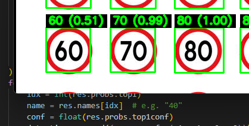

# SudoSpeed: Real-time AU Speed-Sign Detection and Zone Tracking

SudoSpeed detects Australian speed-limit signs and maintains a current zone in real time. It is designed to feed a motorcycle helmet HUD such as MotorHUD. This repository focuses on the vision stack only: detector, recogniser, and zone logic.

<p align="center">
  
</p>

## What is in this repo

```
README.md
SudoSpeed.py
run_speed_reader.py
detect.pt
detect.onnx
classify.pt
classify.onnx
demo/imgs/teaser_01.png
demo/videos/test_short.mp4
LICENSE
```

## Part 1: Environment setup

1. Use Python 3.10 to 3.12.  
2. Install dependencies.
   ```bash
   pip install ultralytics opencv-python numpy pillow rich pyyaml onnxruntime
   # or onnxruntime-gpu on a CUDA machine
   ```
3. Prefer ONNXRuntime on Raspberry Pi. Use PyTorch on a laptop or desktop with CUDA.

## Part 2: Media setup

1. Teaser image path  
   `demo/imgs/teaser_01.png`  
2. Test video path  
   `demo/videos/test_short.mp4`  
3. If the video is larger than 100 MB, enable Git LFS.
   ```bash
   git lfs install
   git lfs track "*.mp4"
   git add .gitattributes demo/videos/test_short.mp4
   ```

## Part 3: Weights and models

1. Detector  
   Files: `detect.pt` or `detect.onnx`  
   Role: finds round AU speed-signs in the frame.  
   ONNX export example from a YOLOv8 `.pt`:
   ```bash
   yolo export model=runs/detect/trainX/weights/best.pt format=onnx opset=12
   ```
2. Recogniser  
   Files: `classify.pt` or `classify.onnx`  
   Role: predicts the sign value such as 40 50 60 80 100 110 from the cropped sign.  
   Train your classifier on cropped sign digits or patches, then export to ONNX if needed.
3. Choosing which to run  
   Raspberry Pi: prefer `detect.onnx` and `classify.onnx`  
   Desktop or laptop with CUDA: `.pt` works well

## Part 4: Detector usage

1. The detector reads frames and returns bounding boxes for candidate signs.  
2. Confidence and IoU thresholds are set with `--conf` and `--iou`.  
3. Tuning tips on Pi  
   • Reduce `--imgsz` to 416 or 512  
   • Cap frame rate with `--fps-max` to keep latency steady

## Part 5: Recogniser usage

1. Each detection is cropped and passed to the classifier.  
2. Only plausible AU values are kept.  
3. Improve robustness by adding hard negatives and varied lighting during training.

## Part 6: Zone logic

1. A sliding window confirms a value before changing the zone.  
2. Hysteresis keeps the current zone unless a stronger, consistent value appears.  
3. A short cooldown after an update avoids rapid flips.  
4. Defaults are set in code. If you externalise them later, use a `config/zone.yaml` like:
   ```yaml
   confirmation:
     window: 8
     min_hits: 5
   hysteresis:
     keep_bias: 0.1
   cooldown_ms: 1500
   expiry_s: 90
   values: [40, 50, 60, 80, 100, 110]
   ```

## Part 7: Runner script `run_speed_reader.py`

Run on the provided test video
```bash
python run_speed_reader.py --source demo/videos/test_short.mp4 --det detect.onnx --rec classify.onnx --view-overlay --save
```

Use a webcam
```bash
python run_speed_reader.py --source 0 --det detect.onnx --rec classify.onnx --view-overlay
```

Process a folder of images
```bash
python run_speed_reader.py --source demo/imgs --det detect.onnx --rec classify.onnx --save
```

Notes  
• On Windows, use forward slashes or double backslashes for paths.  
• Use `--device cuda` if you are running `.pt` models on a machine with CUDA.  
• Use `--headless` on Raspberry Pi if no display is attached.

## Part 8: Library file `SudoSpeed.py`

1. Holds core helpers that the runner imports.  
2. Keep any Pi-specific tweaks here, such as image resizing, simple post-processing, or transport hooks.  
3. If you plan to stream `Z:<kph>` to a HUD, add a simple publisher in this file that writes to serial, BLE, or a socket.

## Part 9: Raspberry Pi quick steps

1. Install system packages
   ```bash
   sudo apt-get update
   sudo apt-get install -y python3-pip libatlas-base-dev libopenjp2-7 libtiff5
   ```
2. Install Python deps
   ```bash
   pip3 install opencv-python numpy pillow onnxruntime rich ultralytics pyyaml
   ```
3. Copy ONNX weights to the repo root  
   `detect.onnx` and `classify.onnx`  
4. Run headless on the test clip
   ```bash
   python3 run_speed_reader.py --source demo/videos/test_short.mp4 --det detect.onnx --rec classify.onnx --view-overlay --headless --save
   ```
5. Swap `--source 0` to use the Pi Camera or a USB camera once drivers are set.

## Part 10: Integrating with a helmet HUD

1. The runner prints a line like `Z:60` when the zone updates.  
2. Bridge that line to your ESP32 hub by serial, BLE, SPP, or XBee.  
3. Keep the transport logic separate from detection so you can iterate on both sides safely.

## Troubleshooting

1. No video output  
   Check codec support and try `--save` to write `out/annotated.mp4`.  
2. Slow on Pi  
   Use ONNX models, reduce `--imgsz`, and use `--fps-max 10`.  
3. Flicker between values  
   Increase `confirmation.window` and `cooldown_ms`, and add more negatives to the recogniser training set.

## License

MIT

## Contact

Maintainer: Mustafa  
Project: SudoSpeed
